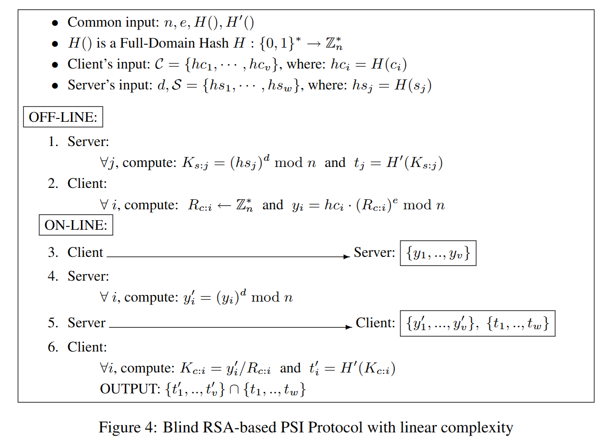

# Blind RSA-based Private Set Intersection Protocol


Source: [1]
### Project Structure:
```
RSA-PSI/
├── .gitignore
├── README.md
├── pyproject.toml
└── src/
    ├── keys/
    │   ├── client_keys.json
    │   └── server_keys.json
    └── psi_project/
        ├── bin/
        │   ├── client.py
        │   ├── server.py
        │   └── __init__.py
        ├── common/
        │   ├── algebra.py
        │   ├── protocol.py
        │   └── __init__.py
        ├── tools/
        │   ├── keygen.py
        │   └── __init__.py
```

### Quick Start:

1. Clone the Repository
```bash
git clone https://github.com/Abhiroop2004/RSA-PSI.git
cd RSA-PSI
```
2. Generate RSA keys
```bash
py -m psi_project.tools.keygen
```
3. Start the Server
```bash
py -m psi_project.bin.server
```
follow the prompt to enter server set values

4. Start the Client
```bash
py -m psi_project.bin.client
```
Enter client set values when prompted

### Mathematical Workflow
#### Server side:

Let  $S = \{ s_1, s_2, \dots, s_w \}$

Compute hashed set:  
$S' = \{ h_{s_1}, h_{s_2}, \dots, h_{s_w} \}$, where $h_{s_i} = H(s_i)$

For each element:
- $K_{s_i} = (h_{s_i})^d \bmod n$
- $t_i = H'(K_{s_i})$

Server stores:  $\{ t_1, t_2, \dots, t_w \}$

Server receives:  $\{ y_1, y_2, \dots, y_v \}$

Compute:
$y'_i = (y_i)^d \bmod n$

Server sends:  $\{ y'_1, \dots, y'_v \}$ and $\{ t_1, \dots, t_w \}$


#### Client side:

Let  $C = \{ c_1, c_2, \dots, c_v \}$

Compute:  $C' = \{ h_{c_1}, h_{c_2}, \dots, h_{c_v} \}$, where $h_{c_i} = H(c_i)$

For each $i$, choose  $R_i \xleftarrow{R} \mathbb{Z}_n^*$

Compute:
$y_i = h_{c_i} \cdot (R_i)^e \bmod n$

Client sends:  $\{ y_1, y_2, \dots, y_v \}$

After receiving $y'_i$:
- $K_{c_i} = y'_i \cdot R_i^{-1} \bmod n$
- ${t_{i}^{,}}$ = $H'(K_{c_i} )$

Output:
{ $t'_1, \dots, t'_v$ } $\cap$ { $t_1, \dots, t_w$ }


### References

1. Freedman, M. J., Nissim, K., & Pinkas, B.  
   *Efficient Private Matching and Set Intersection.*  
   IACR ePrint Archive, 2009/491, 2009.  
   Available at: https://eprint.iacr.org/2009/491.pdf